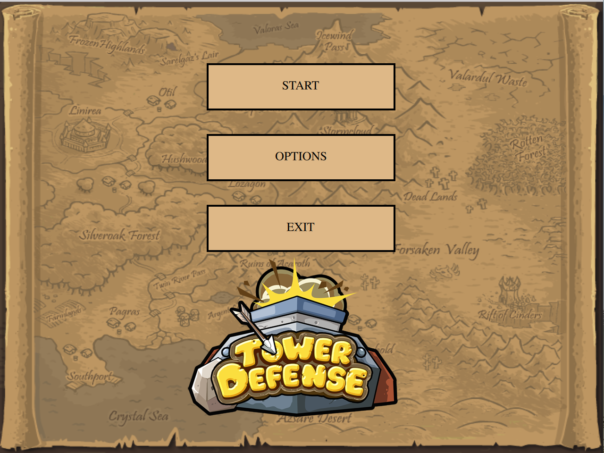
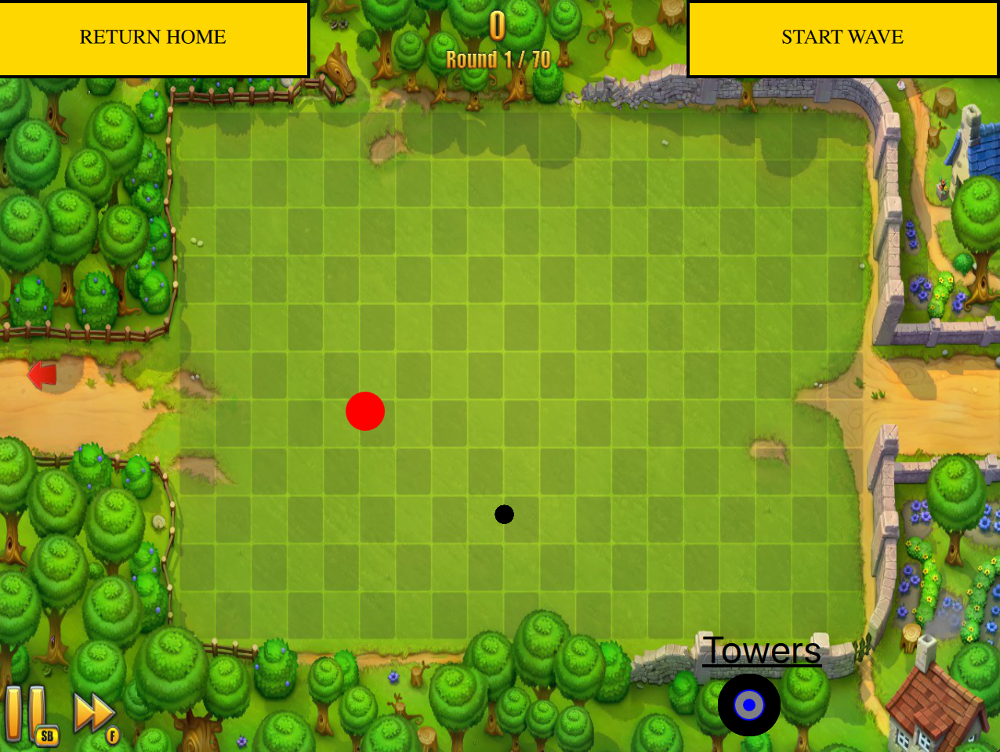

<b>Description:<b>
Cross platform application that lets users play a tower defense style game. 

<b>Technologies:</b> 
C++, Qt, QML, Javascript 

<b>Screenshots:</b> 

<b>Installation:</b> 
1. Install Qt Creator 5.6  
2. Open the project in Qt  
3. Clean all files, build all the files, and run the program.  

<b>Contribution Guidelines:</b> 
For anyone wishing to make contributions to the TowerDefense project please make
a pull request. 

<b>Contributors 
https://github.com/ryanpolaski 

<b>Bugs and TODO List:</b> 
TODO:
- Create more waves of enemies.
- Implement a life system so when enemies rreach the end the player loses lives
- Implement a money system. So when the bullet hits an enemy the player recieves coins
- Possibly design some differant towers/ enemies

<b>Inspiration:</b> 
Create a fun application (based on a game I played as a kid), for people of all ages to play.

<b>License:</b> 
The MIT License
